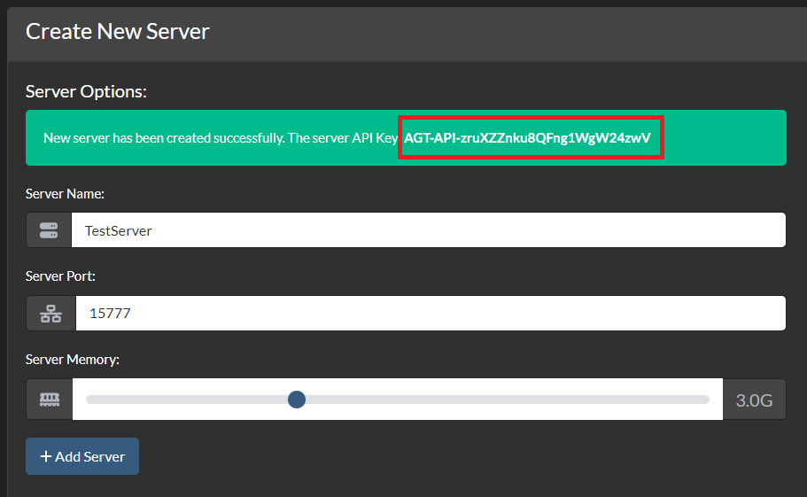
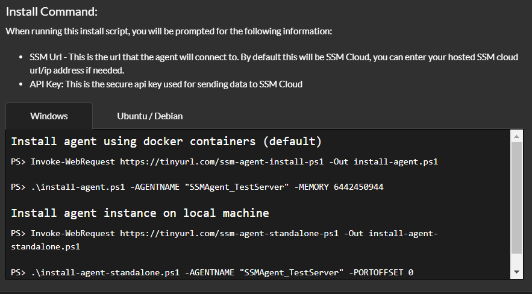
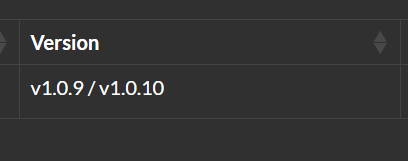

# Getting Started

# Terminology

-   **SSM** - Satisfactory Server Manager.
-   **SSM Cloud** - Satisfactory Server Manager Cloud hosted web portal.
-   **SSM Hosted Cloud** - Satisfactory Server Manager locally hosted web portal.
-   **Agent / Server** - SSM Agent that manages the Satisfactory Server.

# Cloud vs Hosted Cloud

Below we cover the pros and cons of using cloud vs hosted cloud.

## SSM Cloud

**Pros:**

-   Hosted by the Refined R&D team.
-   Rapid Bug fixes.
-   Easy support channels.
-   Free of charge (Hardware).
-   No port-forwarding is required.
-   Software is tested for our environment.

**Cons:**

-   Shared network connection.
-   Requires an internet connection.

## SSM Hosted Cloud

**Pros:**

-   Can be installed on low-level hardware.
-   Can be installed locally on your network.

**Cons:**

-   Requires Port-forwarding if you want to access from the internet.
-   Bugs could be specific to your hardware.
-   Will require spare or purchase hardware.
-   Requires dependant software to be installed (MongoDB)
-   MongoDB will need to be secured before SSM installation.

# Account

## Create An Account

To get started using SSM Cloud, you will need an account.

You can setup an account free of charge using the <a href="/signup">Sign Up Page</a>

On the sign-up page, you will need to enter the following information:

-   Account Details
    -   Account Name - This is the Organization/Community name
-   User Details
    -   Email Address - This is the first user that will be added to the account
    -   Password - Password for the user
    -   Confirm Password - Confirmation Password for the user

## Why do I need an account?

When using SSM Cloud or Hosted SSM Cloud, an account is required. The account acts as a data store for the following information:

-   API Keys
-   Agents
-   Invites
-   Notifications
-   Notification Settings
-   Users
-   User Roles

# Users

## Create a User

Creating a new user account can be done using the <a href="/dashboard/account">Account Page</a> under the `Users` section.

In this section, you need to enter the Users email address. This is the email address to which the invite link will be sent.

> **NOTE**: If you are using Hosted SSM Cloud, it will show the invite link in the success message.

When creating a user, you can assign a [User Role](#user-roles). This will add permissions to the user.

# User Roles

User roles are groups of permissions. This determines what a user can do within the UI.

By default, we create three common user roles:

-   Administrator
-   Super User
-   User

# Servers

## Create a Server

Creating a new server can be done using the <a href="/dashboard/server">Servers Page</a>

In the Create New Server section, you will have three input fields you need to fill in.

-   Server Name - The logical name of the server.
-   Server Port - The port that Satisfactory Server will run with.
-   Server Memory - The amount of Memory the server can use. (**Docker Install Only**)

Once you have created the server, you will get a success message.

> **NOTE:** This message also contains the Server API Key. You will need to take note of this as it's used in the next step.

> **IMPORTANT:** The Server API Key will not be shown again so make sure you make a note of this!

## Installing a new Server

Once you have created the new server, you will need to install the server on your machines.

The following operating systems are supported:

-   Windows 10 and above
-   Windows Server 2019 and above (Standalone only)
-   Ubuntu 22.04 and above
-   Debian 10 and above

### Running the install scripts

On the right of the Create new Server section, you will see the following:

There are two types of scripts:

-   Docker install
    -   Installs the server on a new docker container. This is the most supported, as it allows you to host multiple server instances on the same physical machine.
-   Standalone install
    -   Allows for multiple servers to be run directly on the physical machine

When running the script of your choice, you will be prompted to enter the following details:

-   SSM URL
    -   This is the URL of either your self-hosted SSM Cloud install or the default <a href="https://ssmcloud.hostxtra.co.uk">https://ssmcloud.hostxtra.co.uk</a>.
-   SSM Api Key
    -   This is the API key when creating a new server on the dashboard.

## Updating the Server

When on the <a href="/dashboard/servers">Servers Page</a> in the `Server List` section, you can see all your servers in the table.

When we release a new SSM Agent version on our <a href="https://github.com/SatisfactoryServerManager/SSMAgent">GitHub Repostitory</a> SSM Cloud will check this against the current version you are running.

The image below shows the current version and, on the right, the latest version.

### How to update the Server

To update your server to the latest version, you can re-run the install script with the same parameters, URL and API key.

The Docker install scripts will ask you if you want to get the URL and API Key from the existing docker container for a more convenient update.
